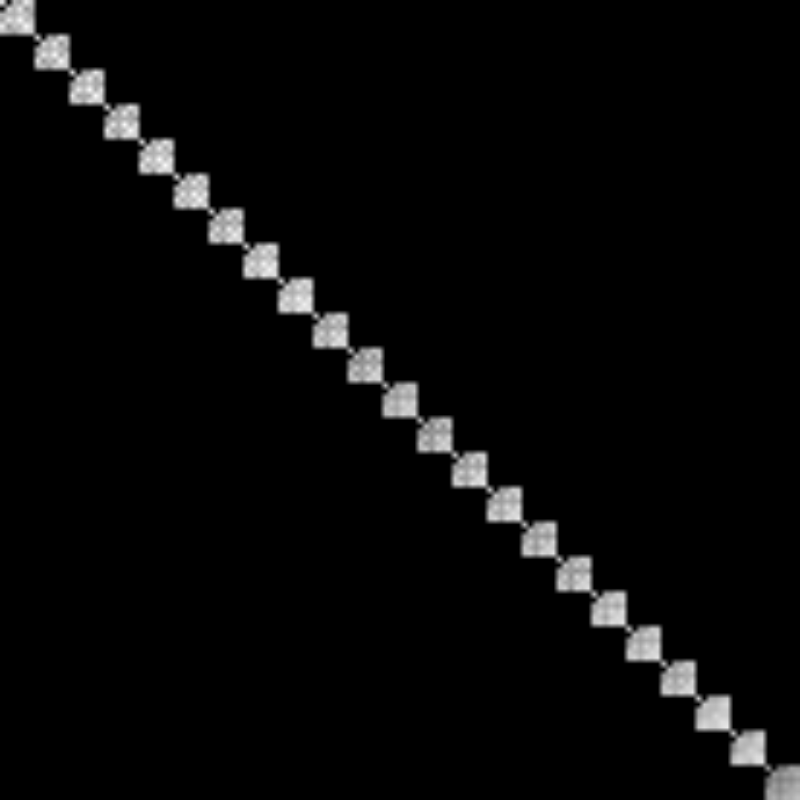
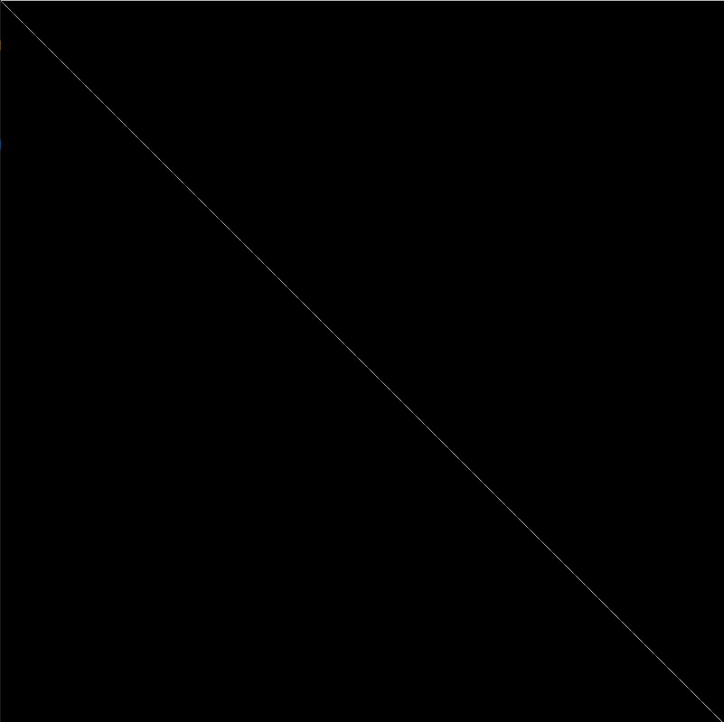
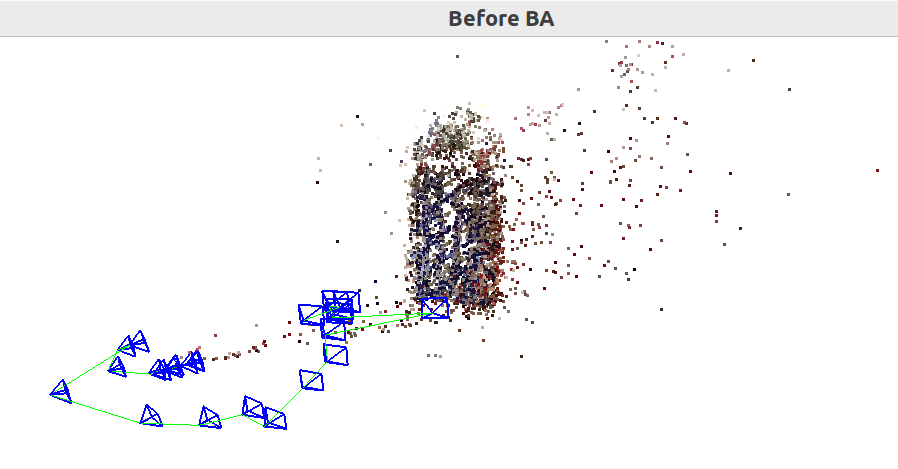
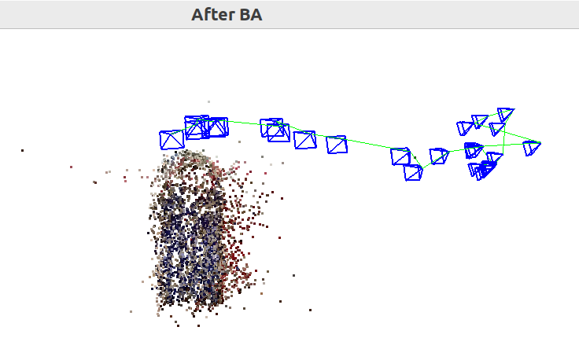

# Sparse Structure from Motion

A monocular sparse SfM pipeline written from scratch in C++.

## What it does

Reconstructs a sparse 3D point cloud and camera trajectory from a monocular video sequence of a textured object. The pipeline runs entirely from scratch — no COLMAP, no g2o, no Ceres, only OpenCV.

## Pipeline overview

```
Video -> Frame extraction -> Calibration
      -> SIFT feature extraction & matching
      -> Initial pair selection (H/F ratio test)
      -> Essential matrix recovery & pose initialization
      -> Triangulation (initial landmarks)
      -> Incremental P3P+RANSAC registration (windowed covisibility matching)
      -> Iterative registration + local BA
      -> Global Bundle Adjustment (LM with Schur complement)
      -> Pangolin 3D visualization
```

## Implemented from scratch

- Geometric ray-intersection triangulation with cheirality and reprojection guards
- P3P solver (Gao et al. 2003) with companion matrix quartic root finding
- RANSAC-P3P pose estimation
- Levenberg-Marquardt Bundle Adjustment with Schur complement
- Analytic Jacobians w.r.t. SE(3) pose perturbation and landmark position (including skew term)
- Gauge freedom fix via fixed anchor frames
- Scale normalization after BA
- Windowed covisibility matching
- Pangolin-based colored point cloud viewer with camera frustums and path

## Results

### BA matrix sparsity structure
<!-- Add screenshots of B, C, E matrix visualizations here -->

**B**<br>


**C**<br>


**E**<br>


### Reconstruction — Before BA


### Reconstruction — After BA

<!--  -->

## Dependencies

- OpenCV 4.5+
- Pangolin
- CMake 3.10+
- C++17

On Ubuntu:
```bash
sudo apt install libopencv-dev
# Install Pangolin from source: https://github.com/stevenlovegrove/Pangolin
```

## Build

```bash
mkdir build && cd build
cmake ..
make -j4
```

To build without tests:
```bash
cmake .. -DBUILD_TESTS=OFF
make -j4
```

## Data preparation and running

**Step 1 — Add your video:**
```
sparse_sfm/
└── data/
    ├── calib.txt      # camera calibration
    └── vid_3.mp4      # input video
```

**Step 2 — Calibrate your camera:**
```bash
cd build
./calibrate ../data/calib.mp4 ../data/calib.txt
```

**Step 3 — Extract frames:**
```bash
cd build
./test_frame_io
```
Frames are extracted to `data/frames_3/` at the interval set by `FRAMES_SAMPLING_INTERVAL` in `constants.hpp`.

**Step 4 — Run the pipeline:**
```bash
cd build
./sparse_sfm
```

Paths are set in `main.cpp`:
```cpp
const std::string CALIB_PATH  = "../data/calib.txt";
const std::string FRAMES_PATH = "../data/frames_3";
```

## Tuning

All pipeline parameters are in `include/constants.hpp`. Key ones:

| Constant | Default | Description |
|---|---|---|
| `FRAMES_SAMPLING_INTERVAL` | 10 | Sample every Nth frame from video |
| `SIFT_NUM_FEATURES` | 2000 | SIFT keypoints per frame |
| `MATCH_WINDOW_SIZE` | 5 | Window for covisibility matching |
| `TRIANGULATION_MAX_REPROJ_ERROR` | 4.0 px | Max reprojection error for triangulation |
| `CULLING_THRESHOLD` | 2.0 px | Post-BA landmark culling threshold |
| `P3P_MIN_INLIERS` | 6 | Minimum RANSAC inliers to accept a pose |
| `BA_GLOBAL_ITERATIONS` | 20 | Global BA iterations |
| `BA_LOCAL_ITERATIONS` | 5 | Local BA iterations per pass |
| `N_REGISTRATION_PASSES` | 5 | Iterative registration passes |
| `MIN_OBS_FOR_BA` | 5 | Min observations per landmark for BA |

## Project structure

```
sparse_sfm/
├── include/          # Headers
├── src/              # Pipeline source files
├── tests/            # Unit tests per module
├── utils/            # Calibration and undistortion tools
├── data/             # Calibration file and extracted frames (not tracked)
├── main.cpp          # Driver
└── CMakeLists.txt
```

## Limitations

- Dense BA matrices — memory usage scales as O(n_landmarks²). Works up to ~6000 landmarks on 16GB RAM.
- Motion blur causes registration gaps. Handled partially by windowed matching.
- Monocular — reconstruction is up to scale.
- No loop closure.

## References

- Gao et al., "Complete Solution Classification for the Perspective-Three-Point Problem", IEEE TPAMI 2003
- Hartley & Zisserman, Multiple View Geometry in Computer Vision
- Joan Solà, "A micro Lie theory for state estimation in robotics"
- Stachniss, Photogrammetry I+II lecture series (YouTube)